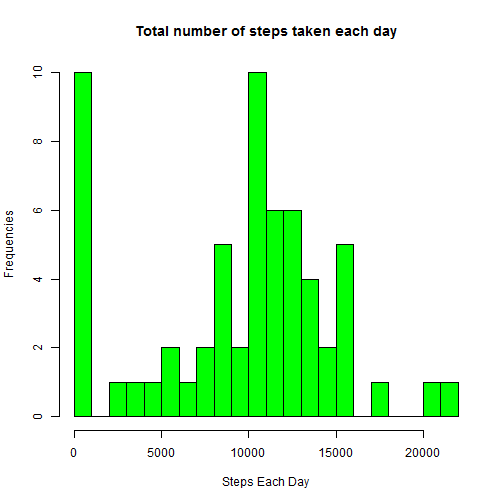

# 'Reproducible Research: Peer assessment 1'
### *14 Feb. 2016*

======================================================================

## Introduction
This is an R Markdown document. It displays the results from the first assignment of John Hopkins' Coursera course, Responsible Research.In the process, the single R markdown document will be processed by knitr and be transformed into an HTML file.  

This assignment makes use of data from a personal activity monitoring device. This device collects data at 5 minute intervals through out the day. The data consists of two months of data from an anonymous individual collected during the months of October and November, 2012 and include the number of steps taken in 5 minute intervals each day.  

The variables included in this dataset are:

- steps: Number of steps taking in a 5-minute interval (missing values are coded as NA)

- date: The date on which the measurement was taken in YYYY-MM-DD format

- interval: Identifier for the 5-minute interval in which measurement was taken

The dataset is stored in a comma-separated-value (CSV) file and there are a total of 17,568 observations in this dataset.

## Loading and preprocessing the data
Load input data from the csv file unpacked from the zip file from the current R working directory.


```r
data <- read.csv("activity.csv", sep = ",", header = T)

# convert 'date' to date data type
data$date <- as.Date(data$date)
```

## What is mean total number of steps taken per day?
Firstly, we need to sum up the total steps taken per day. Here, we use a for loop to sum up all valid steps of each day, and then create a data frame named "steps_each_day".

```r
date <- unique(data[,2])
steps <- vector(length=0)
for(i in 1:length(date)) steps[i] <- sum(na.omit(data[data$date == date[i],]$steps))
steps_each_day <- data.frame(date = date, steps = steps)
```

Plot histogram of the total number of steps taken each day.

```r
hist(steps,
     col = "green",
     xlab = "Steps Each Day",
     ylab = "Frequencies",
     main = "Total number of steps taken each day",
     breaks = 20)
```



Calculate the mean and median of steps.

```r
mean(steps)
```

```
## [1] 9354.23
```

```r
median(steps)
```

```
## [1] 10395
```

## What is the average daily activity pattern?
Calculate the mean value of steps in every intervals, and create a data frame named "steps_each_interval". Samely, I use a for loop here.

```r
interval <- unique(data[,3])
steps2 <- vector(length=0)
for(i in 1:length(interval)) steps2[i] <- mean(na.omit(data[data$interval == interval[i],]$steps))
steps_each_interval <- cbind(interval,steps2)
```

Then, make time series plot of average steps each interval.

```r
plot(interval, steps2, type = "l", 
     xlab = "Interval", 
     ylab = "Number of Steps", 
     main = "Average Steps each interval")
```


Now, we find the 5-minute interval with the containing the maximum number of steps:

```r
steps_each_interval[steps_each_interval[,2] == max(steps2),][1]
```

```
## interval 
##      835
```

## Imputing missing values
- Finding NA values, and get their total numbers.

```r
missing <- sum(is.na(data$steps))
```

- Filling the NA values by interval average values.

```r
data_fill <- data
for(i in 1:nrow(data)){
if(is.na(data_fill[i,1])){
     k <- data_fill[i,3]
     data_fill[i,1] <- as.integer(steps_each_interval[steps_each_interval[,1] == k,][2])
     }
}
```

- Do some examinations.

```r
sum(is.na(data_fill$steps))
```

```
## [1] 0
```

- If the value is 0, then sum up the total steps taken per day. The data frame is named "steps_each_day_fill".

```r
steps3 <- vector(length=0)
for(i in 1:length(date)) steps3[i] <- sum(data_fill[data_fill$date == date[i],]$steps)
steps_each_day_fill <- data.frame(date = date, steps = steps3)
```

- Making Histograms of each-day steps.

```r
hist(steps3,
     col = "blue",
     xlab = "Steps Each Day",
     ylab = "Frequencies",
     main = "Total number of steps taken each day(after Modifying)",
     breaks = 20)
```


- Calculate the mean and median of steps.

```r
mean(steps3)
```

```
## [1] 10749.77
```

```r
median(steps3)
```

```
## [1] 10641
```

Comparing these values with former ones, we know that the mean value increases, while the median value doesn't change much.

## Are there differences in activity patterns between weekdays and weekends?
- Make a judge: "Weekday" or "Weedend"?

```r
for(i in 1:length(date)){
if(weekdays(date[i]) == "Saturday" | weekdays(date[i]) == "Sunday" ) {steps_each_day_fill$type[i] <- "weekend"}
else {steps_each_day_fill$type[i] <- "weekday"}
}
type <- steps_each_day_fill$type
```

- Add the supplement infomations (weekday or weekend) for every day, and create a new data frame "data_fill".

```r
# change the names of weekdays to English form
Sys.setlocale("LC_TIME", "English")
```

```
## [1] "English_United States.1252"
```

```r
# judge and valuation
for(i in 1:nrow(data_fill)){
     if(weekdays(as.Date(data_fill$date[i])) == "Saturday" | weekdays(as.Date(data_fill$date[i])) == "Sunday" )
     {data_fill$type[i] <- "weekend"}
     else {data_fill$type[i] <- "weekday"}
}
```

- Calculate the average values in weekdays and weekends (with a new data frame "steps_each_int_fill").

```r
steps4 <- vector(length=0)
interval2 <- vector(length=0)
for(i in 1:length(interval)){
m <- 2*i - 1
n <- 2*i
interval2[m] <- interval[i]
interval2[n] <- interval[i]
steps4[m] <- mean(data_fill[data_fill$interval == interval[i] & data_fill$type == "weekday",]$steps)
steps4[n] <- mean(data_fill[data_fill$interval == interval[i] & data_fill$type == "weekend",]$steps)
}
steps_each_int_fill <- data.frame(interval = interval2, steps = steps4, type = c("weekday", "weekend"))
```

- Plotting Panel Plot

```r
library("lattice")
p <- xyplot(steps ~ interval | factor(type), data=steps_each_int_fill, 
       type = 'l',
       main="Average Number of Steps Taken 
       \nAveraged Across All Weekday Days or Weekend Days",
       xlab="5-Minute Interval (military time)",
       ylab="Average Number of Steps Taken")
print (p)
```


Slight changes can be viewed from the panel plot. In weekends, people tend to walk less and evener in the daytime than in weekdays. Activity on the weekday has the greatest peak from all steps intervals. And apparently, in the nighttimes, there's no much difference.
